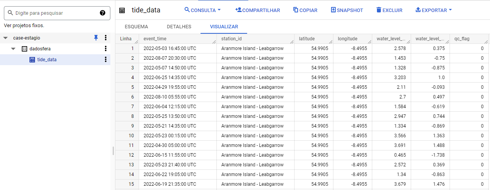
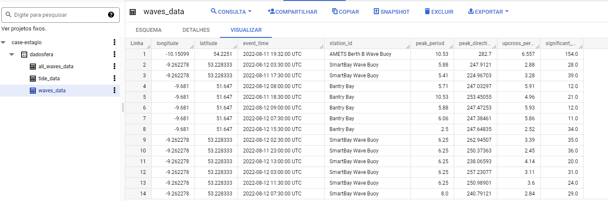
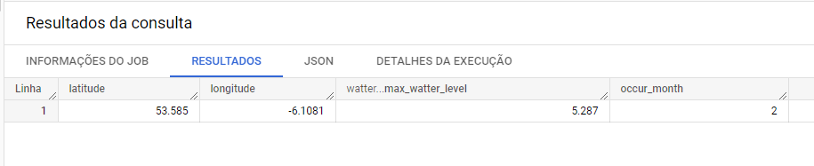
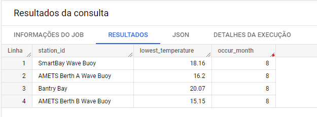

# **Solução do case de estágio** 


# Index
 1. [Visão Geral](#visao-geral)
 2. [Modelagem Solução](#modelagem-solucao) 
 3. [Desenvolvimento](#desenvolvimento)
 3.1. [Preparaçao dos dados](#preparacao)
 3.2. [Queries](#queries)
 3.3  [Wave lengh Correlation](#correlation)


 <h1 id="visao-geral">Visão Geral</h1>

 <h1 id="preparacao-dados">Preparação dos dados</h1>

 Primeiro foi feito o download de todos os arquivos e eles foram salvos nas seguintes pastas
 ```
 ./resources/tides*
 ./resources/waves*
```
* Nota: Os arquivos .csv foram adicionados no .gitignore para evitar o envio para o GitHub.


Em seguida, foram unidos todos os arquivos em 1 só, para facilitar o carregamento e a utilização, utilizando o código a seguir:

```
awk '(NR == 1) || (FNR > 1)' ./resources/Tides/*.csv > ./resources/files/final/tide_data.csv
```

Feito importamos o dado para uma tabela do BigQuery
```
gsutil cp ./resources/files/final/tide_data.csv gs://case-estagio/dadosfera/
```
Depois importamos para uma tabela no BigQuery

```
bq load --source_format=CSV --skip_leading_rows=1 --replace=true dadosfera.tide_data gs://case-estagio/dadosfera/tide_data.csv
```
* O mesmo procedimento foi realizado para os dados de waves

Após os dados carregados, iremos utilizar as tabelas para realização das consultas SQL, como mostrado na imagem abaixo:

Tide table



Waves table

 <h1 id="desenvolvimento">Desenvolvimento</h1>
 

 <h2 id="queries">Queries</h2>
 As queries abaixo foram utilizadas para responder as questões 1 e 2

<a href="queries/lowest_temperature_per_bouys.sql">Query 1 - Lowest Temperature</a>

[Query 2 - Biggest Water Level](queries/lat_long_biggest_water_level.sql)


Sendo os resultados encontrados mostrados abaixo:
 <h4 id="resultados-1">Resultados Questões 1</h4>



<code>
O maior nível de água acontece na latitude = `53.585` e longitude = `-6.1081` no mês de Fevereiro.
</code>
 
  <h4 id="resultados-2">Resultados Questões 2</h4>



```
A menor temperatura para cada uma das regiões é mostrada na imagem acima, e todas elas são no mês de Agosto.
```

 
 <h2 id="correlation">Correlação</h2>

 Finalizando os quesitos básicos, faremos a análise de correlação de Pearson para dados contínuos. Como muitos valores são NaN, faremos a análise apenas para a estação AMETS Berth A Wave Buoy, que contém um conjunto de dados robusto e completo para o cálculo, como mostrado no notebook abaixo.


[notebook](notebooks/case_dadosfera.ipynb).

Após o cálculo de correlação, podemos ver que o Coeficiente de Pearson tem valor de 0.741 demonstrando uma forte correlação positiva entre a altura das ondas e a temperatura do mar. Dessa forma, quanto maior a temperatura do mar, maior será a altura das ondas.
